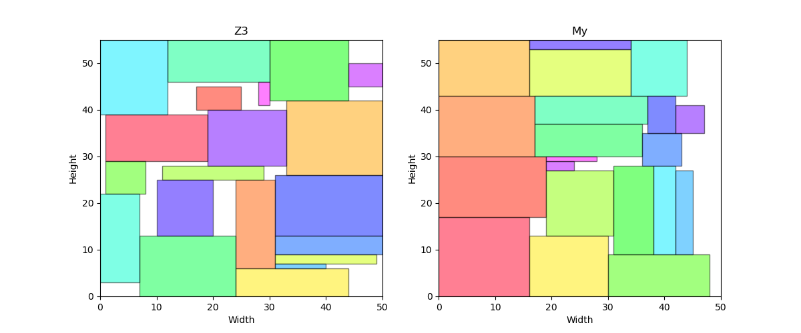
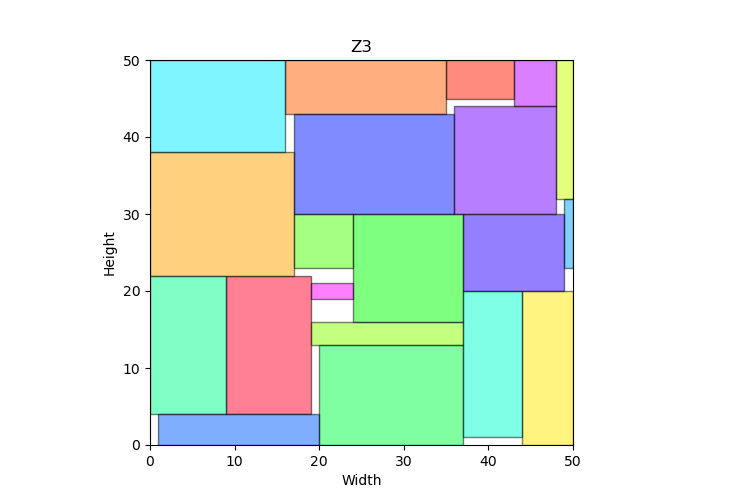

# Rectangle fitting

## 问题

​	Rectangle fitting：Given *a big rectangle* and *a number of small rectangles*, can you fit the small rectangles in the big one such that *no two overlap*.

​	矩形拟合：给定一个大矩形和一些小矩形，你能否将小矩形拟合到大矩形中，使得没有两个重叠。

## 求解算法

### z3

#### 约束构建

Configuration of small rectangles

$$
\left(w_{i}=W_{i} \wedge h_{i}=H_{i}\right) \vee\left(w_{i}=H_{i} \wedge h_{i}=W_{i}\right)
$$


Position of small rectangles

$$
\begin{array}{l}
x_{i} \geq 0 \wedge x_{i}+w_{i} \leq W \\
y_{i} \geq 0 \wedge y_{i}+h_{i} \leq H
\end{array}
$$

No overlap

$$
x_{j} \geq x_{i}+w_{i} \vee x_{i} \geq x_{j}+w_{j} \vee y_{j} \geq y_{i}+h_{i} \vee y_{i} \geq y_{j}+h_{j}
$$

#### 算法实现

```python
def z3_rectangle(big_rectangle, small_rectangles):
    x = [Int("x_%s" % (i + 1)) for i in range(len(small_rectangles))]
    y = [Int("y_%s" % (i + 1)) for i in range(len(small_rectangles))]
    w = [Int("w_%s" % (i + 1)) for i in range(len(small_rectangles))]
    h = [Int("h_%s" % (i + 1)) for i in range(len(small_rectangles))]
    constraints = []
    for i in range(len(small_rectangles)):
        # Configuration of small rectangles
        constraints.append(Or(And(w[i] == small_rectangles[i].width, h[i] == small_rectangles[i].height), And(
            w[i] == small_rectangles[i].height, h[i] == small_rectangles[i].width)))
        # Position of small rectangles
        constraints.append(And(x[i] >= 0, y[i] >= 0, x[i] + w[i] <=
                           big_rectangle.width, y[i] + h[i] <= big_rectangle.height))
        # No overlap
        for j in range(i):
            constraints.append(Or(x[i] + w[i] <= x[j], x[j] + w[j]
                               <= x[i], y[i] + h[i] <= y[j], y[j] + h[j] <= y[i]))
    time1 = time.time()
    solver = Solver()
    solver.add(constraints)
    if solver.check() == sat:
        m = solver.model()
        for i in range(len(small_rectangles)):
            print("x_%s = %s, y_%s = %s, w_%s = %s, h_%s = %s" % (
                i + 1, m[x[i]], i + 1, m[y[i]], i + 1, m[w[i]], i + 1, m[h[i]]))
        time2 = time.time()
        print(time2 - time1)
        visualize(big_rectangle, [MyRectangle(m[w[i]].as_long(), m[h[i]].as_long()) for i in range(len(small_rectangles))],
                  [(m[x[i]].as_long(), m[y[i]].as_long()) for i in range(len(small_rectangles))], 121, "Z3")
    else:
        print("No solution")
        time2 = time.time()
        print(time2 - time1)
```

### 贪心+回溯搜索

#### 算法思路

​	将矩形从大到小排序，首先放置大的矩形，在不能继续放置时回溯。

#### 算法实现

```python
def my_rectangle(big_rectangle, small_rectangles):
    def find_recursion(big_rectangle, small_rectangles, positions, n, result_rectangles):
        rectangle = small_rectangles[n]
        for x in range(big_rectangle.width):
            for y in range(big_rectangle.height):
                position = Position(x, y)
                if x + rectangle.width <= big_rectangle.width and y + rectangle.height <= big_rectangle.height:
                    overlaps = False
                    for i in range(len(positions)):
                        if overlap(rectangle, result_rectangles[i], position, positions[i]):
                            overlaps = True
                            break
                    if not overlaps:
                        positions.append(position)
                        result_rectangles.append(rectangle)
                        if n == len(small_rectangles) - 1:
                            return True
                        else:
                            find = find_recursion(
                                big_rectangle, small_rectangles, positions, n + 1, result_rectangles)
                            if not find:
                                positions.pop()
                                result_rectangles.pop()
                            else:
                                return True
                if x + rectangle.height <= big_rectangle.width and y + rectangle.width <= big_rectangle.height:
                    overlaps = False
                    for i in range(len(positions)):
                        if overlap(MyRectangle(small_rectangles[i].height, small_rectangles[i].width), result_rectangles[i], position, positions[i]):
                            overlaps = True
                            break
                    if not overlaps:
                        positions.append(position)
                        result_rectangles.append(MyRectangle(
                            rectangle.height, rectangle.width))
                        if n == len(small_rectangles) - 1:
                            return True
                        else:
                            find = find_recursion(
                                big_rectangle, small_rectangles, positions, n + 1, result_rectangles)
                            if not find:
                                positions.pop()
                                result_rectangles.pop()
                            else:
                                return True

    time1 = time.time()
    positions = []
    small_rectangles = sorted(
        small_rectangles, key=lambda r: r.width * r.height, reverse=True)
    result_rectangles = []
    find_recursion(big_rectangle, small_rectangles,
                   positions, 0, result_rectangles)

    if len(positions) == len(small_rectangles):
        for i in range(len(small_rectangles)):
            print("x_%s = %s, y_%s = %s, w_%s = %s, h_%s = %s" % (
                i + 1, positions[i].x, i + 1, positions[i].y, i + 1, result_rectangles[i].width, i + 1, result_rectangles[i].height))
        time2 = time.time()
        print(time2 - time1)
        visualize(big_rectangle, result_rectangles, [
                  (positions[i].x, positions[i].y) for i in range(len(positions))], 122, "My")
    else:
        print("No solution")
        time2 = time.time()
        print(time2 - time1)
```

### 结果展示

将算法输出的放置结果绘图显示出来

```python
def visualize(big_rectangle, small_rectangles, positions, pos, title):
    ax = plt.subplot(pos)
    cmap = cm.get_cmap('gist_rainbow')
    for i, rectangle in enumerate(small_rectangles):
        position = positions[i]
        color = i / len(small_rectangles)
        ax.add_patch(Rectangle((position[0], position[1]), rectangle.width,
                               rectangle.height, alpha=0.5, fill=True, edgecolor='black', facecolor=cmap(color)))
    ax.set_xlim([0, big_rectangle.width])
    ax.set_ylim([0, big_rectangle.height])
    ax.set_xlabel('Width')
    ax.set_ylabel('Height')
    ax.set_title(title)
```

## 输入输出

测试样例如下

```
# 大矩形50个单位乘以55个单位，50个小矩形：

# 矩形1: 18x10
# 矩形2: 5x8
# 矩形3: 7x19
# 矩形4: 16x17
# 矩形5: 20x6
# 矩形6: 2x18
# 矩形7: 3x18
# 矩形8: 7x7
# 矩形9: 14x13
# 矩形10: 17x13
# 矩形11: 9x18
# 矩形12: 19x7
# 矩形13: 16x12
# 矩形14: 9x1
# 矩形15: 4x19
# 矩形16: 19x13
# 矩形17: 10x12
# 矩形18: 12x14
# 矩形19: 5x6
# 矩形20: 5x2
```

矩形使用自己定义的 MyRectangle 类

```python
big_rectangle = MyRectangle(50, 55)
small_rectangles = [MyRectangle(18, 10), MyRectangle(5, 8), MyRectangle(7, 19), MyRectangle(16, 17), MyRectangle(20, 6), MyRectangle(2, 18), MyRectangle(3, 18), MyRectangle(7, 7), MyRectangle(14, 13), MyRectangle(17, 13), MyRectangle(9, 18), MyRectangle(19, 7), MyRectangle(16, 12), MyRectangle(9, 1), MyRectangle(4, 19), MyRectangle(19, 13), MyRectangle(10, 12), MyRectangle(12, 14), MyRectangle(5, 6), MyRectangle(5, 2)]
```

然后分别调用 z3 和自己实现的贪心+回溯搜索即可

```python
plt.figure(figsize=(12, 5))
z3_rectangle(big_rectangle, small_rectangles)
my_rectangle(big_rectangle, small_rectangles)
plt.show()
```

输出结果如下

```bash
x_1 = 1, y_1 = 29, w_1 = 18, h_1 = 10
x_2 = 17, y_2 = 40, w_2 = 8, h_2 = 5
x_3 = 24, y_3 = 6, w_3 = 7, h_3 = 19
x_4 = 33, y_4 = 26, w_4 = 17, h_4 = 16
x_5 = 24, y_5 = 0, w_5 = 20, h_5 = 6
x_6 = 31, y_6 = 7, w_6 = 18, h_6 = 2
x_7 = 11, y_7 = 25, w_7 = 18, h_7 = 3
x_8 = 1, y_8 = 22, w_8 = 7, h_8 = 7
x_9 = 30, y_9 = 42, w_9 = 14, h_9 = 13
x_10 = 7, y_10 = 0, w_10 = 17, h_10 = 13
x_11 = 12, y_11 = 46, w_11 = 18, h_11 = 9
x_12 = 0, y_12 = 3, w_12 = 7, h_12 = 19
x_13 = 0, y_13 = 39, w_13 = 12, h_13 = 16
x_14 = 31, y_14 = 6, w_14 = 9, h_14 = 1
x_15 = 31, y_15 = 9, w_15 = 19, h_15 = 4
x_16 = 31, y_16 = 13, w_16 = 19, h_16 = 13
x_17 = 10, y_17 = 13, w_17 = 10, h_17 = 12
x_18 = 19, y_18 = 28, w_18 = 14, h_18 = 12
x_19 = 44, y_19 = 45, w_19 = 6, h_19 = 5
x_20 = 28, y_20 = 41, w_20 = 2, h_20 = 5
2.481384038925171
x_1 = 0, y_1 = 0, w_1 = 16, h_1 = 17
x_2 = 0, y_2 = 17, w_2 = 19, h_2 = 13
x_3 = 0, y_3 = 30, w_3 = 17, h_3 = 13
x_4 = 0, y_4 = 43, w_4 = 16, h_4 = 12
x_5 = 16, y_5 = 0, w_5 = 14, h_5 = 13
x_6 = 16, y_6 = 43, w_6 = 18, h_6 = 10
x_7 = 19, y_7 = 13, w_7 = 12, h_7 = 14
x_8 = 30, y_8 = 0, w_8 = 18, h_8 = 9
x_9 = 31, y_9 = 9, w_9 = 7, h_9 = 19
x_10 = 17, y_10 = 30, w_10 = 19, h_10 = 7
x_11 = 17, y_11 = 37, w_11 = 20, h_11 = 6
x_12 = 34, y_12 = 43, w_12 = 10, h_12 = 12
x_13 = 38, y_13 = 9, w_13 = 4, h_13 = 19
x_14 = 42, y_14 = 9, w_14 = 3, h_14 = 18
x_15 = 36, y_15 = 28, w_15 = 7, h_15 = 7
x_16 = 37, y_16 = 35, w_16 = 5, h_16 = 8
x_17 = 16, y_17 = 53, w_17 = 18, h_17 = 2
x_18 = 42, y_18 = 35, w_18 = 5, h_18 = 6
x_19 = 19, y_19 = 27, w_19 = 5, h_19 = 2
x_20 = 19, y_20 = 29, w_20 = 9, h_20 = 1
0.14980506896972656
```

z3 用时 2.48s，贪心+回溯搜索用时0.149s



在搜索容易满足的样例时，z3 的速度较慢，贪心的效果较好。但若是搜索难以满足的样例，z3的效率则显著高于自己实现的算法，例如将上述样例的大矩形改为 50*50，z3 算法可以在 30s 输出结果，但自己实现的算法在 30min 内都未能得到结果。

```bash
x_1 = 9, y_1 = 4, w_1 = 10, h_1 = 18
x_2 = 35, y_2 = 45, w_2 = 8, h_2 = 5
x_3 = 16, y_3 = 43, w_3 = 19, h_3 = 7
x_4 = 0, y_4 = 22, w_4 = 17, h_4 = 16
x_5 = 44, y_5 = 0, w_5 = 6, h_5 = 20
x_6 = 48, y_6 = 32, w_6 = 2, h_6 = 18
x_7 = 19, y_7 = 13, w_7 = 18, h_7 = 3
x_8 = 17, y_8 = 23, w_8 = 7, h_8 = 7
x_9 = 24, y_9 = 16, w_9 = 13, h_9 = 14
x_10 = 20, y_10 = 0, w_10 = 17, h_10 = 13
x_11 = 0, y_11 = 4, w_11 = 9, h_11 = 18
x_12 = 37, y_12 = 1, w_12 = 7, h_12 = 19
x_13 = 0, y_13 = 38, w_13 = 16, h_13 = 12
x_14 = 49, y_14 = 23, w_14 = 1, h_14 = 9
x_15 = 1, y_15 = 0, w_15 = 19, h_15 = 4
x_16 = 17, y_16 = 30, w_16 = 19, h_16 = 13
x_17 = 37, y_17 = 20, w_17 = 12, h_17 = 10
x_18 = 36, y_18 = 30, w_18 = 12, h_18 = 14
x_19 = 43, y_19 = 44, w_19 = 5, h_19 = 6
x_20 = 19, y_20 = 19, w_20 = 5, h_20 = 2
27.705974578857422
```



