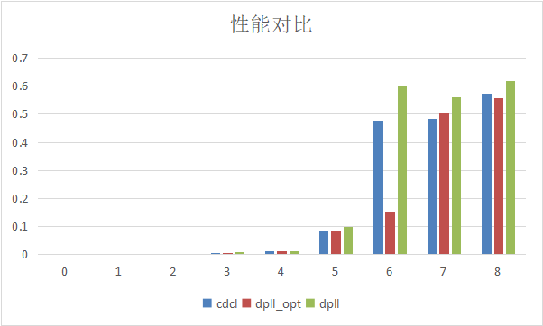
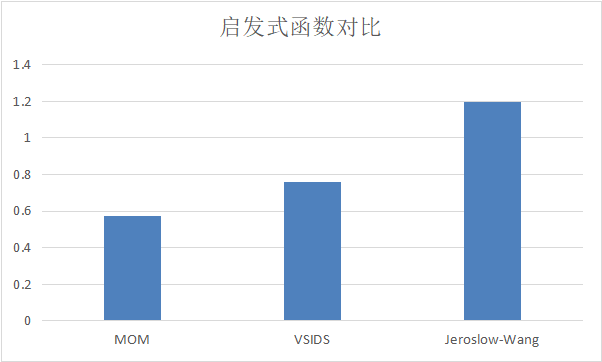

# SAT

## 简介

​	在实验中实现了对 SAT 问题的求解，使用了 DPLL，CDCL 两种算法完成规模在 $10^2$ 量级的问题的求解，测试样本选自历年[satcompetition](http://www.satcompetition.org/)。将 DPLL 的递归版本优化为回溯版本并加入 pure literal elimination，在 CDCL 中实现了 Backjump 与子句学习，尝试了不同的变量选择启发式函数，包括MOM、Jeroslow-Wang、VSIDS，并对比了算法之间的性能差异以及不同启发式函数对于性能的影响。阅读了 SAT 2005 获奖求解器 [MiniSat](http://minisat.se/) 的手册以评估当前实现与其性能差异与改进方向。

## SAT 问题

- 定义1： 对于一个给定的命题公式，它是可满足的吗？

- 定义2： 对于一个给定的 CNF（合取范式） 公式，它是可满足的吗？

一个命题公式可以在多项式时间内用 *Tseitin transformation* 转换为 CNF 公式，因此只需考虑定义2。但 CNF-SAT 问题是 NP-HARD。

## 求解算法

### DPLL

- 尽可能多的使用 *Unit resolution*
- 选择一个变量 p ，将其赋值为 p 或者 ~p ，沿着两条路径继续搜索

算法伪代码如下

```
X:=unit-resol(X)
if ⊥ ∈ X then
return(unsatisfiable)
if X = ∅ then
return(satisfiable)
if ⊥ ̸∈ X then
choose variable p in X
DPLL(X ∪ {p})
DPLL(X ∪ {¬p})
return satisfiable if either of the two branches return satisfiable else return unsatisfiable
```

其中 choose variable p in X 对算法的性能有着较大影响，需要一个较好的启发式函数来选择变量p

#### Unit resolution

当合取范式中存在一个单位字句 l 时，消除所有包含 l 的子句，消除所有 ~l

### 变量选择启发式函数

#### 启发式函数1

​	选择出现最多的变量，因为变量出现的次数越多，说明在使用这个变量进行 Unit resolution 后能够简化或者消除的子句越多，从而尽快发现矛盾或者找到可满足的解。

#### 启发式函数2

​	选择长度最小的子句并任意选择其中的一个变量，因为这样可以尽快产生独立子句，从而进行 Unit resolution

#### 启发式函数3（MOM heuristics）

​	这种启发式函数是第一种和第二种的结合，选择长度最小的子句并选择其中在全部子句中出现最多的变量。这种启发式函数结合了第一种和第二种的优点，但也会带来更大的计算开销。

#### 启发式函数4（VSIDS heuristic）

​	VSIDS 的全称为 Variable State Independent Decaying Sum（独立变量状态衰减和） 是著名的 SAT 求解器 Chaff 提出的，在[2]Madigan C F, Malik S, Moskewicz M W, et al. Chaff: Engineering an efficient SAT solver[C]//Proceedings of DAC. 2001.中发表。它的核心思想如下：

```
（1）每个变量的每个文字都有一个计数器，初始值为0；

（2）当增添一个子句到数据库中，子句中对应的文字的计数器增加1；

（3）在每次决策时，选择未赋值的最大分值变量进行赋值；

（4）如果存在相同的最大分支的变量，则在他们之间随机选择一个变量赋值；

（5）所有的计数器定期的乘以0<α<1的常数。
```

​	这个启发式函数是基于 CDCL 的，在冲突中学习了一个新子句后，会增加这个新子句包含的变量的计数值，从而诱导搜索器先去搜索这个学习子句相关的变量，从而更早引发冲突而发生剪枝。

#### 启发式函数5 （Jeroslow-Wang heuristic）

​	Jeroslow-Wang heuristic 是 dynamic literal individual sum heuristic (DLIS) 的一种常见变式，在[3]Jeroslow R G, Wang J. Solving propositional satisfiability problems[J]. Annals of mathematics and Artificial Intelligence, 1990, 1(1-4): 167-187.中发表，它选取使得以下的函数值最大的变量

$$
score(I) := \sum_{I \in c \wedge c \in \varphi} 2^{-\left | c  \right | }
$$

​	当合取范式中一个子句包含的变量越多时，这个子句相对容易满足，只要任何一个变量满足即可，因此这个子句中每个变量对于子句满足的贡献就会下降。一个有 $n$ 个变量的合取范式的真值表项共有 $2^n$ ，因此可以用 $2^{-n}$来衡量这个子句中的一个变量的重要性，因为随着变量的增多，真值表项是指数增加的，从而满足这个公式的可能性也指数增加，而变量的重要性指数减小。在一个合取范式中一个变量的重要性取决于它所在的所有子句中的重要性之和，以此来优先决策更重要的变量。

### DPLL 优化

- 用回溯替代递归
- 用一个列表 M 记录搜索历史，在 M 中标记 Unit resolution 和 决策的变量，当发生冲突时，回溯至上一个决策变量的位置，选择决策变量的非

- 加入 pure literal elimination

#### pure literal elimination

​	当合取范式中一个变量 l 全部以 l 形式出现，或全部以 ~l 形式出现时，可以对其进行赋值，并把所有相关子句删除。

### CDCL

​	Conflict Driven Clause Learning（CDCL）是指在发生冲突时从冲突中学习新的子句，从而避免冲突的发生

​	在 CDCL 中利用冲突子句可以将部分 backtrack (回溯) 改为 backjump

#### backjump

​	在发生冲突时，如果发现合取范式可以推出公式 $C \vee l$ 并且在某一步决策发生之后可以推出 $\neg C$ ，那么 $l$ 必然成立，通常公式 $C \vee l$ 可以从冲突中发现，并且可以发现早在最后一步决策之前就可以推出 $\neg C$，那么就可以跳过对于最后一个决策变量的回溯，而在更早的决策变量处回溯，这被称为 backjump

#### 子句学习

​	在发生冲突时，对于产生冲突变量的相关子句，可以将它们合并从而产生新的子句，将这个子句加入合取范式中可以使搜索器从冲突中学习

#### 遗忘与重启

​	在学习了新的子句后，合取范式中原有的子句可能变成冗余的，可以从合取范式中遗忘冗余子句。

​	在学习了几个子句后可以适时清空 M 从而重启搜索，已经学习的子句会改变搜索路径，从而找到更好的搜索路径以避免以前发生过的冲突，如何选择重启时机也需要启发式函数。

## 算法实现 

### 输入文件格式

文件格式采取 DIMACS format，参照 [SAT Competition 2009](http://www.satcompetition.org/2009/format-benchmarks2009.html)

```
c 
c 从注释开始
c 
c 
p cnf 5 3 
1 -5 4 0 
-1 5 3 4 0 
-3 -4 0
```

- 该文件可以以注释开头，即以字符 c 开头的行。
- 紧跟在注释后面的是 p cnf nbvar nbclauses 这一行，表示该实例是 CNF 格式；nbvar 是文件中出现的变量的确切数量；nbclauses 是文件中包含的子句的确切数量。
- 然后是从句。每个子句都是位于同一行的 -nbvar 和 nbvar 之间以 0 结尾的一系列不同的非空数字；它不能同时包含相反的文字 i 和 -i。正数表示相应的变量。负数表示相应变量的非。

### 数据结构定义

#### 通用

子句：vector<int>

合取范式：表示为一系列子句的集合，vector<vector<int>>

变量的赋值：vector<int>

#### DPLL优化

搜索历史列表M：vector<pair<int, bool>>

合取范式栈：vector<vector<vector<int>>>

赋值栈：vector<vector<int>>

### CDCL

下标记录： vector<int>

下标记录栈：vector<vector<int>>

### Unit resolution

```c++
void unit_resolution(int x, vector<vector<int>> &clauses, vector<int> &assignment) {
    for (int i = 0; i < clauses.size(); i++) {
        for (int j = 0; j < clauses[i].size(); j++) {
            if (clauses[i][j] == x) {
                clauses.erase(clauses.begin() + i);
                i--;
                break;
            } else if (clauses[i][j] == -x) {
                clauses[i].erase(clauses[i].begin() + j);
                break;
            }
        }
    }
    assignment[abs(x) - 1] = x;
}
```

### 变量选择的启发式函数

#### 启发式函数1

```c++
// find the variable with the most occurrences
int var_selection1(int n, vector<vector<int>> clauses) {
    int x = 0;
    vector<int> count;
    for (int i = 0; i < n; i++) {
        count.push_back(0);
    }
    for (int i = 0; i < clauses.size(); i++) {
        for (int j = 0; j < clauses[i].size(); j++) {
            count[abs(clauses[i][j]) - 1]++;
        }
    }
    int max = 0;
    for (int i = 0; i < n; i++) {
        if (count[i] > max) {
            max = count[i];
            x = i + 1;
        }
    }
    return x;
}
```

#### 启发式函数2

```c++
// find the smallest clause and return the first variable in it
int var_selection2(int n, vector<vector<int>> clauses) {
    int x = 0;
    int min = n + 1;
    for (int i = 0; i < clauses.size(); i++) {
        if (clauses[i].size() < min) {
            min = clauses[i].size();
            x = abs(clauses[i][0]);
        }
    }
    return x;
}
```

#### 启发式函数3（MOM heuristics）

```c++
// find the smallest clause and return the variable with the most occurrences in it
int var_selection3(int n, vector<vector<int>> clauses) {
    int x = 0;
    int min_index = 0;
    int min = n + 1;
    for (int i = 0; i < clauses.size(); i++) {
        if (clauses[i].size() < min) {
            min = clauses[i].size();
            min_index = i;
        }
    }

    vector<int> count;
    for (int i = 0; i < n; i++) {
        count.push_back(0);
    }
    for (int i = 0; i < clauses.size(); i++) {
        for (int j = 0; j < clauses[i].size(); j++) {
            count[abs(clauses[i][j]) - 1]++;
        }
    }
    int max = 0;
    for (int j = 0; j < clauses[min_index].size(); j++) {
        if (count[abs(clauses[min_index][j]) - 1] > max) {
            max = count[abs(clauses[min_index][j]) - 1];
            x = abs(clauses[min_index][j]);
        }
    }
    return x;
}
```

#### 启发式函数4（VSIDS heuristic）

```c++
// VSIDS heuristic
int var_selection4(int n, vector<pair<float, float>> &activity, vector<int> assignment) {
    int x = 0;
    float max = -1;
    for (int i = 0; i < n; i++) {
        if (assignment[i] == 0) {
            if (activity[i].first > max) {
                max = activity[i].first;
                x = i + 1;
            }
            if (activity[i].second > max) {
                max = activity[i].second;
                x = -(i + 1);
            }
        }
        activity[i].first = activity[i].first * 0.90;
        activity[i].second = activity[i].second * 0.90;
    }
    return x;
}
```

#### 启发式函数5 （Jeroslow-Wang heuristic）

```c++
// Jeroslow-Wang heuristic
int var_selection5(int n, vector<vector<int>> clauses) {
    int x = 0;
    vector<pair<float, float>> count;
    for (int i = 0; i < n; i++) {
        count.push_back(make_pair(0, 0));
    }
    for (int i = 0; i < clauses.size(); i++) {
        for (int j = 0; j < clauses[i].size(); j++) {
            if (clauses[i][j] > 0) {
                count[abs(clauses[i][j]) - 1].first += 1 / pow(2, clauses[i].size());
            } else {
                count[abs(clauses[i][j]) - 1].second += 1 / pow(2, clauses[i].size());
            }
        }
    }
    float max = 0;
    for (int i = 0; i < n; i++) {
        if (count[i].first + count[i].second > max) {
            max = count[i].first + count[i].second;
            if (count[i].first > count[i].second) {
                x = i + 1;
            } else {
                x = -(i + 1);
            }
        }
    }
    return x;
}
```

### DPLL

#### unit resolution

```c++
// unit resolution
{
    bool change = true;
    while (change) {
        change = false;
        for (int i = 0; i < clauses.size(); i++) {
            if (clauses[i].size() == 1) {
                for (int j = 0; j < clauses.size(); j++) {
                    if (clauses[j].size() == 1 && clauses[i][0] == -clauses[j][0]) { // conflict
                        return;
                    }
                }
                change = true;
                unit_resolution(clauses[i][0], clauses, assignment);
                i = -1;
            }
        }
    }
}
```

#### branch

```c++
// branch
vector<int> assumption;
assumption.push_back(x);
clauses.push_back(assumption);
dpll(n, clauses, assignment);
clauses[clauses.size() - 1][0] = -x;
dpll(n, clauses, assignment);
```

### DPLL 优化

#### unit resolution

```c++
// unit resolution
{
    bool change = true;
    while (change) {
        change = false;
        for (int i = 0; i < clauses.size(); i++) {
            if (clauses[i].size() == 1) {
                change = true;
                bool conflict = false;
                for (int j = 0; j < clauses.size(); j++) {
                    if (clauses[j].size() == 1 && clauses[i][0] == -clauses[j][0]) { // conflict
                        if (clauses_stack.size() == 0) {
                            return false;
                        } else {
                            clauses = clauses_stack[clauses_stack.size() - 1];
                            clauses_stack.pop_back();
                            assignment = assignment_stack[assignment_stack.size() - 1];
                            assignment_stack.pop_back();
                            for (int k = M.size() - 1; k >= 0; k--) {
                                if (M[k].second == false) {
                                    M.pop_back();
                                } else {
                                    break;
                                }
                            }
                            M[M.size() - 1].first = -M[M.size() - 1].first;
                            M[M.size() - 1].second = false;
                            unit_resolution(M[M.size() - 1].first, clauses, assignment);
                            conflict = true;
                            break;
                        }
                    }
                }
                if (!conflict) {
                    M.push_back(make_pair(clauses[i][0], false));
                    unit_resolution(clauses[i][0], clauses, assignment);
                }
                break;
            }
        }
    }
}
```

#### pure literal elimination

```c++
// pure literal elimination
{
    vector<pair<int, int>> pure;
    for (int i = 0; i < n; i++) {
        pure.push_back(make_pair(0, 0));
    }
    for (int i = 0; i < clauses.size(); i++) {
        for (int j = 0; j < clauses[i].size(); j++) {
            if (clauses[i][j] > 0) {
                pure[abs(clauses[i][j]) - 1].first++;
            } else {
                pure[abs(clauses[i][j]) - 1].second++;
            }
        }
    }
    for (int i = 0; i < n; i++) {
        if ((pure[i].first != 0 && pure[i].second == 0) ||
            (pure[i].first == 0 && pure[i].second != 0)) {
            M.push_back(make_pair((pure[i].first != 0) ? (i + 1) : -(i + 1), false));
            unit_resolution((pure[i].first != 0) ? (i + 1) : -(i + 1), clauses, assignment);
        }
    }
}
```

### CDCL

#### backjump

```c++
for (int k = 0; k < M.size(); k++) {
    if (conflict_clause.size() == 1) {
        m++;
        if (m < clauses_stack.size()) {
            while (k < M.size() && M[k].second == false) {
                k++;
            }
            M.erase(M.begin() + k, M.end());
        }
        break;
    }
    auto it = find(conflict_clause.begin(), conflict_clause.end(), -M[k].first);
    if (it != conflict_clause.end()) {
        conflict_clause.erase(it);
    }
    if (M[k].second == true) {
        m++;
    }
}
```

#### 子句学习

```c++
vector<int> conflict_clause;
for (int k = 0; k < original_clauses[index[i]].size(); k++) {
    if (original_clauses[index[i]][k] != clauses[i][0]) {
        if (find(conflict_clause.begin(), conflict_clause.end(), original_clauses[index[i]][k]) == conflict_clause.end()) {
            conflict_clause.push_back(original_clauses[index[i]][k]);
        }
    }
}
for (int k = 0; k < original_clauses[index[j]].size(); k++) {
    if (original_clauses[index[j]][k] != clauses[j][0]) {
        if (find(conflict_clause.begin(), conflict_clause.end(), original_clauses[index[j]][k]) == conflict_clause.end()) {
            conflict_clause.push_back(original_clauses[index[j]][k]);
        }
    }
}
```

## 性能对比

### 输入输出

输入 cnf 文件的绝对路径，输出三种算法的运算结果与计算时间

```assembly
Input file: F:\Code\C++\SAT\input\input0.txt
---cdcl---
Time: 0s
SAT
1 -2 3 0
backjump_count:0
learn_count:0
---dpll_opt---
Time: 0s
SAT
1 -2 3 0
---dpll---
Time: 0s
SAT
1 -2 3 0
```

### 运算时间

由于 UNSAT 的样例在求解时的难度会大于相同规模下的 SAT 样例，因此以下除 0 号样例外均为 UNSAT 样例

测试样本选自历年[satcompetition](http://www.satcompetition.org/)

| example                        | cdcl     | dpll_opt | dpll     |
| ------------------------------ | -------- | -------- | -------- |
| 0 (3 variables, 6 clauses)     | 0s       | 0s       | 0s       |
| 1 (26 variables, 70 clauses)   | 0s       | 0s       | 0s       |
| 2 (36 variables, 84 clauses)   | 0.001s   | 0.001s   | 0.001s   |
| 3 (60 variables, 168 clauses)  | 0.007s   | 0.007s   | 0.009s   |
| 4 (72 variables, 168 clauses)  | 0.014s   | 0.014s   | 0.014s   |
| 5 (36 variables, 96 clauses)   | 0.085s   | 0.085s   | 0.099s   |
| 6 (48 variables, 81 clauses)   | 0.478s   | 0.154s   | 0.598s   |
| 7 (46 variables, 122 clauses)  | 0.484s   | 0.507s   | 0.56s    |
|                                | 0.574s   | 0.558s   | 0.619s   |
| 9 (60 variables, 160 clauses)  | 18.414s  | 18.332s  | 18.69s   |
| 10 (70 variables, 186 clauses) | 149.133s | 166.431s | 168.142s |



​	可以看到在优化后求解时间比起优化前有所降低

​	对于不同启发式函数在样例 8 (46 variables, 122 clauses) 上的求解时间对比如下



### MiniSat

​	使用 MiniSat 求解上述11个样例的求解时间均在 0.2s 以内，自己实现的求解器与 MiniSat 的性能仍有较大差距。

​	通过阅读 [1]MiniSat 的手册，自己实现的求解器与 MiniSat 的区别在于 MiniSat 采用了更好的变量选择启发式函数以及子句学习重启的启发式函数，同时 MiniSat 的子句学习并不只是对于两个冲突子句简单取并，而是通过图算法来学习新的子句。除此之外，在基础数据结构上，自己实现的求解器使用 vector 来进行子句的保存与访问，但 MiniSat 使用类似于跳表的结构来存储和访问子句，这样能大幅降低迭代时的访问代价。

## 参考文献

[1]Niklas Een, Niklas S orensson Chalmers University of Tehnology, Sweden An Extensible SAT-solver. [MiniSat](http://minisat.se/downloads/MiniSat.pdf)

[2]Madigan C F, Malik S, Moskewicz M W, et al. Chaff: Engineering an efficient SAT solver[C]//Proceedings of DAC. 2001.[Google Scholar](https://scholar.google.com/scholar?q=Chaff:+engineering+an+efficient+SAT+solver&hl=zh-CN&as_sdt=0&as_vis=1&oi=scholart)

[3]Jeroslow R G, Wang J. Solving propositional satisfiability problems[J]. Annals of mathematics and Artificial Intelligence, 1990, 1(1-4): 167-187.[Google Scholar](https://scholar.google.com.hk/scholar?q=Solving+propositional+satisfiability+problems&hl=zh-CN&as_sdt=0,5)

