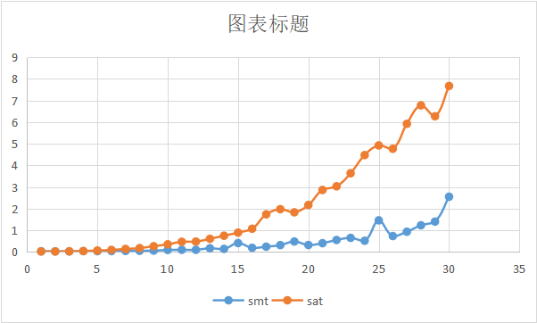

# 实验小作业 1

## 实验内容

使用 pure SAT 求解 N-Queen 问题, 并对比 PPT 中 SMT的实现的效率。

## 实现方法

### SMT实现代码

参照ppt中的代码实现，将其中直接使用solve()的部分替换为先定义Solver()，再调用其check()函数实现，避免solve()直接输出结果，可以选择是否输出结果

```python
def solve_n_queens_smt(n):
    Q = [Int('Q_ % i' % (i + 1)) for i in range(n)]
    val_c = [And(1 <= Q[i], Q[i] <= n) for i in range(n)]
    col_c = [Distinct(Q)]
    diag_c = [If(i == j, True,
                 And(i + Q[i] != j + Q[j], i + Q[j] != j + Q[i]))
              for i in range(n) for j in range(i)]
    solver = Solver()
    solver.add(val_c + col_c + diag_c)
    time1 = time.time()
    if solver.check() == sat:
        model = solver.model()
        print(model)
    else:
        print(None)
    time2 = time.time()
    return time2 - time1
```

### pure SAT 实现代码

使用 $n^2$ 个bool变量来表示棋盘上每个各自是否有皇后

```python
board = [[Bool("x_%s_%s" % (i, j)) for j in range(n)] for i in range(n)]
```

参照ppt上给出的表达式添加行列约束、对角线约束后求解

```python
    # 行、列约束
    constraints = [Or([board[i][j] for j in range(n)]) for i in range(n)]
    constraints += [Or(Not(board[i][j]), Not(board[i][k])) for i in range(n) for j in range(n) for k in
                    range(j + 1, n)]
    constraints += [Or([board[i][j] for i in range(n)]) for j in range(n)]
    constraints += [Or(Not(board[i][j]), Not(board[k][j])) for j in range(n) for i in range(n) for k in
                    range(i + 1, n)]
    # 对角线约束
    for i1 in range(n):
        for i2 in range(i1+1, n):
            for j1 in range(i2-i1, n):
                j2 = i1 + j1 - i2
                constraints += [Or(Not(board[i1][j1]), Not(board[i2][j2]))]
            for j1 in range(n+i1-i2):
                j2 = i2 - i1 + j1
                constraints += [Or(Not(board[i1][j1]), Not(board[i2][j2]))]
```

在求解出一个解后，将整个解取反后添加进约束里，再次求解，可以求出一个新的解

```python
solver.add(Or([Not(board[i][solution[i]]) for i in range(n)]))
```

总共可以求解出92个不同的8皇后问题解，证明求解器是正确的

## 时间效率比较

利用time模块记录求解前后的时间，从而得到求解所需时间

```python
time1 = time.time()
solve_n_queens_smt(i)
time2 = time.time()
```

利用xlwt模块将得到的数据写入excel表格中

```python
sheet.write(i, 1, time2 - time1)
```

### 考虑约束

测试了n=1-30的八皇后问题得到的时间如下，表格中的单位为s

| n    | smt         | sat         |
| ---- | ----------- | ----------- |
| 1    | 0.032696009 | 0.02432394  |
| 2    | 0.028729439 | 0.023478985 |
| 3    | 0.027443171 | 0.031441212 |
| 4    | 0.040308475 | 0.043921471 |
| 5    | 0.037757397 | 0.067116022 |
| 6    | 0.041532755 | 0.096455097 |
| 7    | 0.049678326 | 0.140230179 |
| 8    | 0.055125237 | 0.179906368 |
| 9    | 0.063485146 | 0.265981674 |
| 10   | 0.093383789 | 0.355042219 |
| 11   | 0.101350307 | 0.471684456 |
| 12   | 0.099750042 | 0.480115652 |
| 13   | 0.173116684 | 0.608057976 |
| 14   | 0.142171621 | 0.750790596 |
| 15   | 0.413173437 | 0.89496398  |
| 16   | 0.19419837  | 1.075185776 |
| 17   | 0.244863272 | 1.740051985 |
| 18   | 0.317147493 | 1.978920221 |
| 19   | 0.483903408 | 1.833220005 |
| 20   | 0.322504759 | 2.171975613 |
| 21   | 0.405950785 | 2.866449118 |
| 22   | 0.554072618 | 3.034321547 |
| 23   | 0.652403593 | 3.638399839 |
| 24   | 0.518769503 | 4.476513624 |
| 25   | 1.462782621 | 4.924557447 |
| 26   | 0.735449314 | 4.768963337 |
| 27   | 0.935583591 | 5.922097445 |
| 28   | 1.233241796 | 6.776253462 |
| 29   | 1.404477358 | 6.271222353 |
| 30   | 2.554721355 | 7.672781944 |

利用上面的数据作图



可以看到smt和sat两种方法的求解时间都随着时间增长，但sat需要的时间大于smt，且sat增长的速度要远大于smt，呈现明显的指数增长趋势，而smt的求解时间在增长中略有波动但总体上是在增长，这是因为sat随着n的增大建立约束的时间增长的很快。

### 不考虑约束

下面统计忽略smt和sat的建立约束时间时，求解所用的时间，表格中的单位为s

| n    | smt         | sat         |
| ---- | ----------- | ----------- |
| 1    | 0.012456417 | 0.010125875 |
| 2    | 0.012049437 | 0.010415554 |
| 3    | 0.01354599  | 0.011992931 |
| 4    | 0.016493797 | 0.013623238 |
| 5    | 0.015160799 | 0.016418695 |
| 6    | 0.015442848 | 0.014411688 |
| 7    | 0.018213987 | 0.018607855 |
| 8    | 0.026043653 | 0.018215895 |
| 9    | 0.022395134 | 0.019855022 |
| 10   | 0.03025198  | 0.031572342 |
| 11   | 0.052717209 | 0.025303125 |
| 12   | 0.035099268 | 0.030604839 |
| 13   | 0.11108017  | 0.03355217  |
| 14   | 0.074064493 | 0.039632082 |
| 15   | 0.427565336 | 0.041383028 |
| 16   | 0.12395525  | 0.04669857  |
| 17   | 0.158180475 | 0.084676027 |
| 18   | 0.186808348 | 0.058271646 |
| 19   | 0.435023785 | 0.066119671 |
| 20   | 0.218062401 | 0.078808784 |
| 21   | 0.213495493 | 0.082783699 |
| 22   | 0.450067282 | 0.168174505 |
| 23   | 0.54340291  | 0.243100882 |
| 24   | 0.368357658 | 0.282231092 |
| 25   | 1.413767815 | 0.274524927 |
| 26   | 0.621433496 | 0.314234018 |
| 27   | 0.924998999 | 0.31401062  |
| 28   | 0.999616861 | 0.335293055 |
| 29   | 1.411822319 | 0.158597231 |
| 30   | 2.88436532  | 0.372548103 |


可以看到，在不考虑约束建立时间时sat方法的求解时间小于smt

# 实验小作业 2

## 实验内容

使用 pure SAT 求解 d=a+b 或 d=a-b, 其中a,b为正整数。

## 实现方法

ppt中给出的方法计算了d=a+b，此时的约束包括进位约束、结果约束、以及a和b的值带来的约束，在这几个约束的共同作用下求出d。只要保持进位约束、结果约束不变，将a和b的值带来的约束替换为d和a的值的约束，就能计算b=d-a，再将a、b、d的字母替换一下就可以得到题目中的d=a-b，下面为避免混淆仍然用b=d-a

### 加法实现

用两个变量保存a和b的值

```python
    a_num = 13
    b_num = 7
```

用bool型变量表示a、b、c、d的二进制的每一位

```python
    a = [Bool("a_%s" % i) for i in range(n)]
    b = [Bool("b_%s" % i) for i in range(n)]
    d = [Bool("d_%s" % i) for i in range(n)]
    c = [Bool("c_%s" % i) for i in range(n + 1)]
```

添加进位约束和结果约束

```python
    constraints = [d[i] == (a[i] == (b[i] == c[i])) for i in range(n)]
    constraints += [c[i + 1] == (Or(And(a[i], b[i]), And(a[i], c[i]), And(b[i], c[i]))) for i in range(n)]
    constraints += [Not(c[n])]
    constraints += [Not(c[0])]
```

利用移位运算添加a和b的值产生的约束

```python
    for i in range(n):
        if a_num & (1 << i):
            constraints += [a[i]]
        else:
            constraints += [Not(a[i])]
        if b_num & (1 << i):
            constraints += [b[i]]
        else:
            constraints += [Not(b[i])]
```

### 减法实现

将a和b的值产生的约束替换为d和a的值产生的约束

```python
    for i in range(n):
        if a_num & (1 << i):
            constraints += [a[i]]
        else:
            constraints += [Not(a[i])]
        if d_num & (1 << i):
            constraints += [d[i]]
        else:
            constraints += [Not(d[i])]
```

### 实验结果

替换加法函数中a_num b_num的值即可计算d_num = a_num + b_num

替换减法函数中a_num d_num的值即可计算b_num = d_num - a_num

利用ppt中的例子计算如下`20 = 13 + 7`  `7 = 20 - 13`

