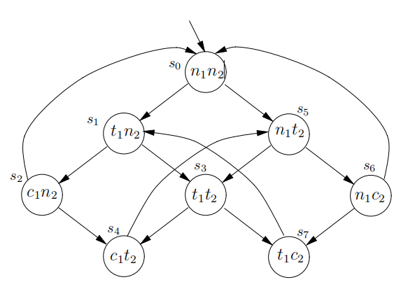

# 实验小作业

## 实验内容

使用 NuSMV 实现 PPT 中 first-attempt model, 要求

- 用 CTL 设计 Non-blocking, No strict sequencing, 并验证所有四个性质
- 给出源码、实验报告

## 实现方法

### 模型构建



```assembly
MODULE main
    VAR
        st1 : {n, t, c};
        st2 : {n, t, c};

    ASSIGN
        init(st1) := n;
        next(st1) :=
            case
                (st1 = n) : {st1, t};
                (st1 = t) & (st2 = c) : st1;
                (st1 = t) & (st2 != c) : {st1, c};
                (st1 = c) & (st2 = n)  : {st1, n};
                (st1 = c) & (st2 != n)  : n;
            esac;

        init(st2) := n;
        next(st2) :=
            case
                (next(st1) = st1) & (st2 = n) : t;
                (next(st1) = st1) & (st2 = t) & (st1 != c) : c;
                (next(st1) = st1) & (st2 = c) : n;
                TRUE : st2;
            esac;
```

### 约束构建

- Safety: Only one process is in its critical section at any time.
- Liveness: Whenever any process requests to enter its critical section, it will eventually be permitted to do so.
- Non-blocking: A process can always request to enter its critical section.
- No strict sequencing: Processes need not enter their critical section in strict sequence.

```assembly
    -- Safety
    LTLSPEC G !(st1 = c & st2 = c)

    -- Liveness
    LTLSPEC G ((st1 = t -> F st1 = c) & (st2 = t -> F st2 = c))

    -- Non-blocking
    CTLSPEC AG ((st1 = n -> EX st1 = t) & (st2 = n -> EX st2 = t))

    -- No strict sequencing
    CTLSPEC AG (st1 = c -> E[!(st2 = c) U st1 = c]) | AG (st2 = c -> E[!(st1 = c) U st2 = c])
```

## 运行结果

```assembly
-- specification AG ((st1 = n -> EX st1 = t) & (st2 = n -> EX st2 = t))  is true
-- specification (AG (st1 = c -> E [ !(st2 = c) U st1 = c ] ) | AG (st2 = c -> E [ !(st1 = c) U st2 = c ] ))  is true
-- specification  G !(st1 = c & st2 = c)  is true
-- specification  G ((st1 = t ->  F st1 = c) & (st2 = t ->  F st2 = c))  is false
-- as demonstrated by the following execution sequence
Trace Description: LTL Counterexample
Trace Type: Counterexample
  -> State: 1.1 <-
    st1 = n
    st2 = n
  -> State: 1.2 <-
    st2 = t
  -- Loop starts here
  -> State: 1.3 <-
    st1 = t
  -> State: 1.4 <-
    st1 = c
  -> State: 1.5 <-
    st1 = n
  -> State: 1.6 <-
    st1 = t
```

运行结果表示 first-attempt model 满足 `Safety` `Non-blocking` `No strict sequencing` 三个要求，但不满足 `Liveness`要求 

