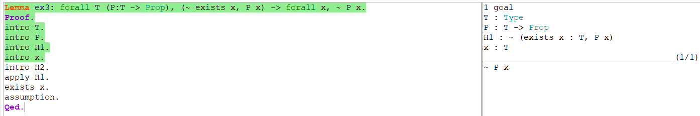
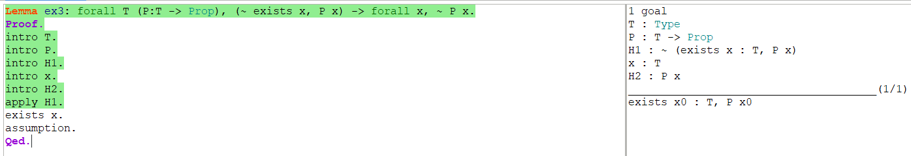

# 实验小作业

## 命题1

```assembly
Lemma ex1: forall A, ~~~ A -> ~ A.
Proof.
intro A.
intro H1.
intro H2.
apply H1.
intro H3.
apply H3.
apply H2.
Qed.
```


## 命题2

```assembly
Lemma ex2: forall A B, A \/ B -> ~ (~ A /\ ~ B).
Proof.
intro A.
intro B.
intro H1.
intro H2.
destruct H1 as [H3 | H4].
destruct H2 as [H5 H6].
apply H5.
assumption.
destruct H2 as [H5 H6].
apply H6.
assumption.
Qed.
```


## 命题3

```assembly
Lemma ex3: forall T (P:T -> Prop), (~ exists x, P x) -> forall x, ~ P x.
Proof.
intro T.
intro P.
intro H1.
intro x.
intro H2.
apply H1.
exists x.
assumption.
Qed.
```








